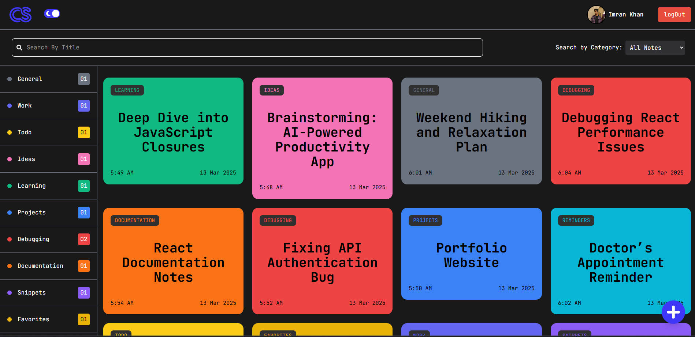

# CodeScribe 📝💻

The **ultimate note-taking app** built exclusively for coders. ✍️💻
Effortlessly organize your thoughts, snippets, and ideas in one place.

---

## 🚀 Features

- 📝 **Rich Text Editing** with TipTap
- 🔍 **Search & Filter Notes** by category
- 🔒 **Secure Authentication** with Firebase
- 📂 **Organized Categories**: Work, Ideas, Snippets, etc.
- ☁️ **Real-time Sync** across devices
- 🌙 **Dark Mode Support**
- 📜 **Markdown & Code Blocks**

---

## 🖼️ Screenshots


 
  
 
  
  
  
 

---

## 🛠️ Tech Stack

- **Frontend:** React, Tailwind CSS
- **Backend:** Firebase Authentication & Firestore
- **Rich Text Editing:** TipTap

---

## 🔧 Installation

```bash
# Clone the repository
git clone https://github.com/imrancodes/Note-Taking-App
cd Note-Taking-App

# Install dependencies
npm install

# Start the development server
npm run dev
```

---

## 🏗️ Usage

1. **Sign up / Log in** to create and manage notes.
2. **Add, Edit, Delete** notes with a powerful editor.
3. **Categorize your notes** for easy organization.
4. **Search & filter** notes instantly.
5. **Sync across devices** with Firebase.

---

## 🌟 Contributing

We welcome contributions! Feel free to open an issue or submit a pull request.

```bash
# Create a new branch
git checkout -b feature-branch

# Commit your changes
git commit -m 'Added new feature'

# Push to GitHub
git push origin feature-branch
```

---
